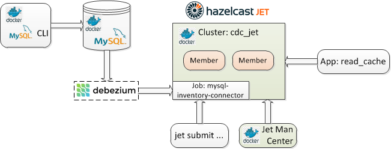
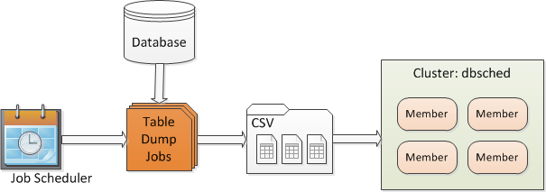
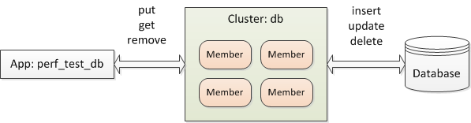

# Hazelcast Bundle Catalog - Use Cases

The online bundles can be installed by executing the `install_bundle` commands as shown below. To view use case details for each bundle, click on their image.

---

## CDC Tutorial - Jet 4.0

```console
install_bundle -download bundle-imdg-3.12.6-cluster-app-dbsched-pado_dbsched-perf_test_dbsched.tar.gz
```

[](help/bundle-jet-4.0-docker-cdc_tutorial/README.md)

---

## CVS File Importer (VersionedPortable) - IMDG 3.12.x

```console
install_bundle -download bundle-imdg-3.12.4-app-pado.tar.gz
```
[](help/bundle-imdg-3.12.4-app-pado/README.md)

---

## DB Scheduler - IMDG 3.12.x

```console
install_bundle -download bundle-imdg-3.12.6-cluster-app-dbsched-pado_dbsched-perf_test_dbsched.tar.gz
```

[](help/bundle-imdg-3.12.6-cluster-app-dbsched-pado_dbsched-perf_test_dbsched/README.md)

---

## DB Sync - IMDG 3.12.x

```console
install_bundle -download bundle-imdg-3.12.6-cluster-app-db-perf_test_db.tar.gz
```

[](help/bundle-imdg-3.12.6-cluster-app-db-perf_test_db/README.md)
